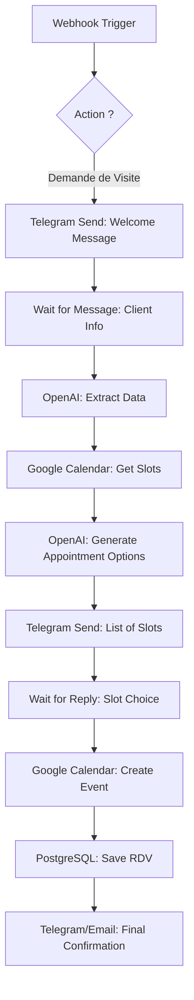

# Plan de Workflow d'Automation - PFE

Ce document détaille l'implémentation technique du workflow d'automatisation pour la plateforme "Dubai Luxury Properties".

## 🏗️ Architecture Globale
Le système repose sur quatre piliers :
1. **Frontend (React)** : Interface utilisateur et point d'entrée du workflow.
2. **Backend (Node.js/Express)** : Gestion des données et API de support.
3. **Plateforme d'Automation (n8n ou Make)** : Le "cerveau" qui orchestre les API.
4. **Services Externes** : Telegram (Interface client), OpenAI (IA Conversationnelle), Google Calendar (Planning).

---

## 🗺️ Mapping Technique du Workflow (15 Étapes)

| Étape | Action | Composant Technique | Détails de l'implémentation |
| :--- | :--- | :--- | :--- |
| **1-2** | Navigation | **Frontend** | React Router + `Properties.jsx` |
| **3** | Demande de visite | **Frontend** | Composant `TelegramButton.jsx` ouvrant `t.me/BotUsername?start=prop_ID` |
| **4** | Webhook | **n8n / Make** | Node "Webhook" qui reçoit l'ID du bien et l'ID Telegram du client |
| **5** | Accueil | **Telegram Bot API** | Le Bot envoie un message : "Bienvenue ! Je suis votre assistant de luxe..." |
| **6-7** | Conversation IA | **OpenAI API** | Intégration GPT-4 pour extraire (Nom, Email, Tel) du texte libre |
| **8** | Google Calendar | **Google API** | Node "Google Calendar" configuré avec le `calendar_id` de l'agent associé au bien |
| **9-10** | Créneaux | **Logic / IA** | Script Node.js qui compare les créneaux libres avec le fuseau horaire Dubaï |
| **11-12** | Choix & RDV | **Telegram / GCal** | Bouton "Inline Keyboard" sur Telegram -> Confirmation en un clic sur GCal |
| **13-14** | Notifications | **SMTP / Telegram** | Node "Gmail/Outlook" pour l'agent + Message de confirmation au client |
| **15** | Enregistrement | **PostgreSQL** | Appel final à `/api/appointments` pour insérer le RDV en base de données locale |

---

## 🛠️ Détails des Composants à Configurer

### 1. Le "Cerveau" (Automation Platform : n8n)
Nous recommandons l'utilisation de **n8n** pour sa capacité à être auto-hébergé (idéal pour un PFE) :
- **Nodes requis** : HTTP Request, OpenAI, Google Calendar, PostgreSQL, Telegram Connection.
- **Trigger** : Telegram Bot (Message Received) ou Webhook (depuis le bouton du site).

### 2. L'Intelligence Artificielle (OpenAI)
L'IA ne doit pas juste répondre, elle doit "extraire".
- **Prompt System** : "Tu es un agent immobilier de luxe. Ton but est de collecter le nom, l'email et le téléphone du client de manière courtoise."
- **Fonctionnement** : Utilisation de "Function Calling" pour structurer les données collectées avant le stockage.

### 3. Synchronisation Backend/Automation
- Le backend doit exposer un endpoint sécurisé pour que la plateforme d'automation puisse enregistrer le résultat final :
- **POST** `/api/appointments/automated` (Nécessite une API Key secrète partagée).

---

---

## 🧩 Détail du Workflow n8n 

Voici la structure logique que vous devez reproduire dans l'interface de n8n :

### Visualisation du Flux (Mermaid)


### Détail des Nodes Principaux

#### 1. Node "Extract Data" (OpenAI)
- **Modèle** : `gpt-4o` ou `gpt-3.5-turbo`
- **Rôle** : Transformer du texte brut en JSON.
- **Input** : "Je m'appelle Amine, mon email est amine@test.com et mon numéro est 0612345678"
- **Output JSON attendu** :
  ```json
  {
    "nom": "Amine",
    "email": "amine@test.com",
    "tel": "0612345678"
  }
  ```

#### 2. Node "Get Available Slots" (Google Calendar)
- **Opération** : `List`
- **Paramètres** : `timeMin` (Maintenant), `timeMax` (Dans 7 jours).
- **Logique** : Ce node récupère les événements existants. Le workflow utilisera ensuite un node **Code** (JavaScript) pour calculer les trous (espaces vides) de 30 minutes entre les rendez-vous existants.

#### 3. Node "Save RDV" (Postgres / HTTP Request)
- **Méthode** : `POST`
- **URL** : `http://votre-ip-serveur:5000/api/appointments`
- **Body** :
  ```json
  {
    "bien_id": "{{id_du_bien}}",
    "client_id": "{{client_id_auto_gen}}",
    "date_heure": "{{data_de_rdv_choisie}}",
    "notes": "RDV programmé via le Bot Telegram"
  }
  ```

---

## 🚀 Guide de Configuration n8n

1.  **Credentials** : Allez dans "Settings" -> "Credentials" pour ajouter :
    - **Telegram Bot API** (via Token @BotFather)
    - **Google Calendar OAuth2** (via Google Cloud Console)
    - **OpenAI API Key**
2.  **Webhooks** : Notez bien l'URL fournie par le node Webhook (ex: `https://votre-n8n.com/webhook/123-abc`). C'est cette URL que vous mettrez dans les variables d'environnement de votre site web.
3.  **PostgreSQL** : Si n8n tourne dans le même Docker que le site, utilisez `db` comme host. Sinon, utilisez l'adresse IP publique de votre serveur de base de données.

---

---

## 🏁 Étapes pour Réussir l'Implémentation

Pour réussir ce workflow, suivez ces étapes dans l'ordre chronologique :

### Étape 1 : Préparation des API et Comptes
1.  **OpenAI** : Créez une clé API sur le portail OpenAI et assurez-vous d'avoir quelques crédits.
2.  **Telegram** : Créez votre Bot via `@BotFather`, récupérez le **Token** et notez le **Username** du bot.
3.  **Google Cloud** : Créez un projet, activez l'API **Google Calendar** et créez des identifiants **OAuth2**.
4.  **n8n** : Installez n8n (via Docker de préférence) et créez vos premières "Credentials".

### Étape 2 : Configuration du Point d'Entrée (Site Web)
1.  Dans votre fichier `.env` du Frontend, renseignez le `VITE_TELEGRAM_BOT_USERNAME`.
2.  Vérifiez que le bouton "Demander une visite" sur le catalogue redirige bien vers `https://t.me/NomDuBot?start=id_du_bien`.

### Étape 3 : Construction du Workflow n8n
1.  **Trigger** : Placez un node "Telegram Trigger" pour intercepter les messages "/start".
2.  **Action IA** : Connectez le node OpenAI. Donnez-lui le "System Prompt" pour l'extraction de données.
3.  **Logique Calendrier** : Ajoutez le node Google Calendar. Testez d'abord la lecture des événements existants.
4.  **Calcul local** : Utilisez un node "Code" (JavaScript) pour transformer les événements Google en créneaux libres de 30 minutes.

### Étape 4 : Interaction et Confirmation
1.  **Proposition** : Configurez le node Telegram pour envoyer les créneaux sous forme de boutons (Inline Buttons).
2.  **Enregistrement** : Paramétrez le node HTTP Request (ou Postgres) pour envoyer les données finales vers votre backend `/api/appointments`.

### Étape 5 : Tests et Vérifications
1.  **Test Unitaire** : Envoyez un message manuellement au Bot Telegram et vérifiez dans n8n si les données sont bien extraites.
2.  **Test de bout en bout** : 
    - Cliquez sur le site -> Telegram s'ouvre.
    - Discutez avec l'IA.
    - Choisissez un créneau.
    - Vérifiez que le rendez-vous apparaît dans votre **Google Calendar** ET sur votre **Dashboard Admin**.

---

---

## ⭐ Idées Bonus pour un Workflow "Parfait"

Pour impressionner davantage lors de votre présentation de PFE, voici des fonctionnalités avancées que vous pouvez ajouter :

### 1. Rappels Automatiques (Reminders)
- **Logique** : n8n vérifie chaque matin les RDV du jour et envoie un rappel via Telegram 1 heure avant la visite.
- **Bénéfice** : Réduit les "No-shows" (clients qui ne viennent pas).

### 2. Qualification Automatique (AI Lead Scoring)
- **Logique** : L'IA analyse les questions du client et attribue un score de "Sérieux".
- **Bénéfice** : L'agent peut prioriser les clients qui ont un budget validé ou un besoin urgent.

### 3. Support Multilingue Intelligent
- **Logique** : n8n détecte la langue du premier message (ex: Anglais, Arabe, Français) et l'IA répond instantanément dans la même langue.
- **Bénéfice** : Indispensable pour un marché international comme Dubaï.

### 4. Visites Virtuelles Intégrées
- **Logique** : Si le client ne peut pas se déplacer, le Bot propose un lien vers une visite 3D (Matterport) ou planifie un appel vidéo zoom.
- **Bénéfice** : Gain de temps pour les investisseurs étrangers.

### 5. Follow-up (Suivi après visite)
- **Logique** : 2 heures après le rendez-vous, le Bot envoie automatiquement un questionnaire de satisfaction : "Comment s'est passée votre visite ?".
- **Bénéfice** : Collecte de précieux feedbacks pour l'agence.

### 6. Distribution "Round-Robin" (Équilibrage)
- **Logique** : Si plusieurs agents sont disponibles, le système attribue le RDV à celui qui en a le moins pour équilibrer la charge de travail.
- **Bénéfice** : Management d'équipe plus équitable.

---

## 🛡️ Sécurité et Fiabilité
- **Validation** : Vérifier si l'email collecté par l'IA est au bon format.
- **Conflits** : Revérifier la disponibilité Google Calendar au moment exact du clic final (Double-Check).
- **Fallback** : Si le bot ne comprend pas, transférer la conversation à un agent humain (Dashboard Admin).
